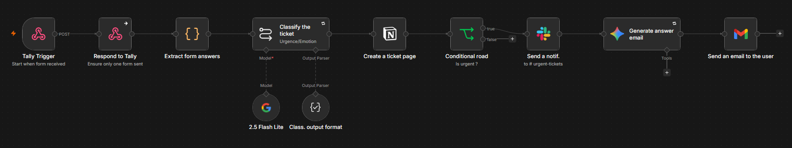
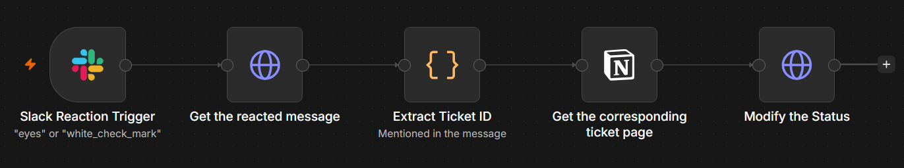
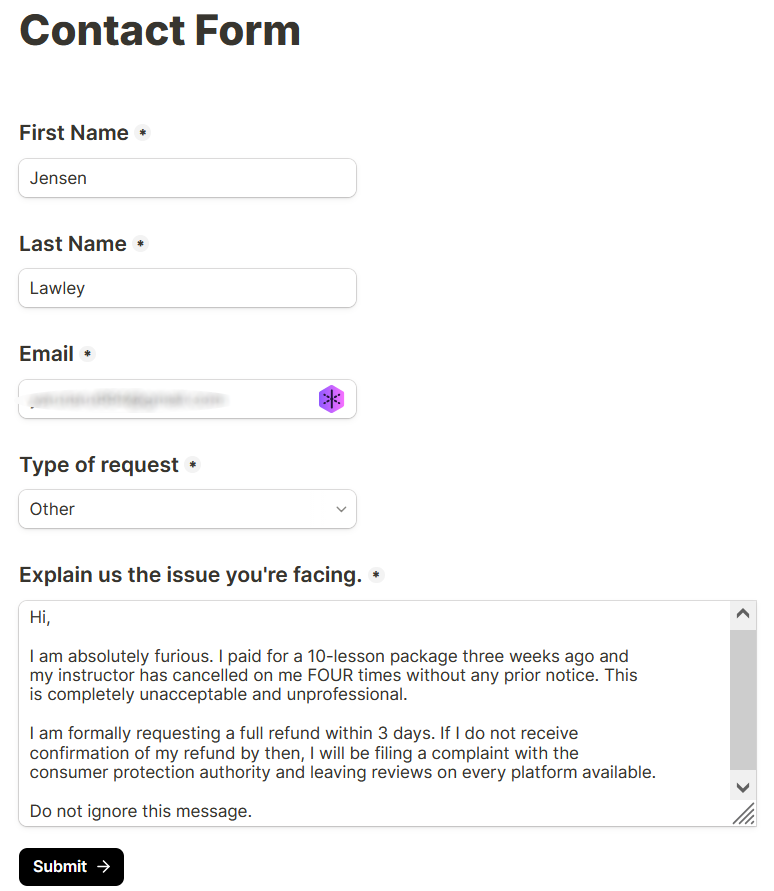
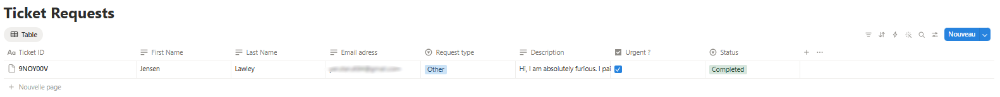
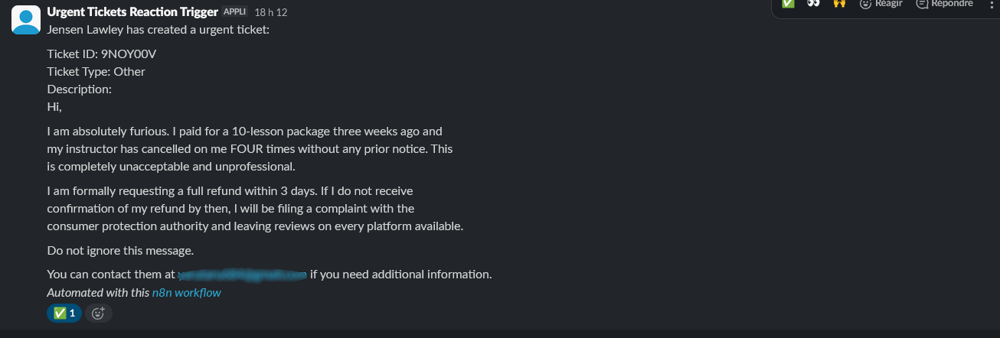
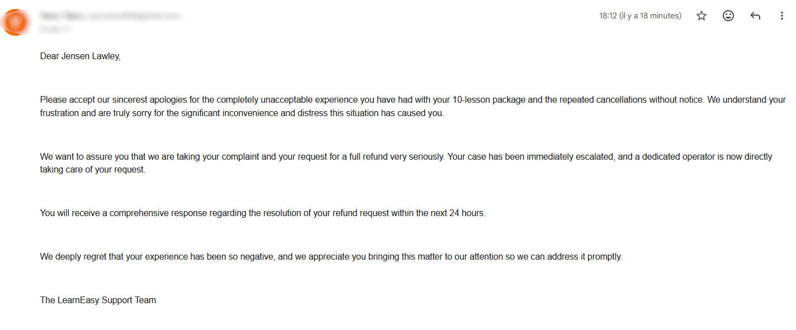

# Ticket Automation with n8n

An automated support ticket pipeline built with n8n, triggered by a Tally form submission. The workflow classifies tickets using AI, tracks them in Notion, notifies the team via Slack, and sends a personalized email response to the client.

---

## Overview

This project simulates a real-world customer support automation system for a driving school. It demonstrates how n8n can orchestrate multiple services into a seamless, intelligent workflow.

**Two workflows are included:**

- **Main Workflow** - Handles ticket intake, AI classification, Notion tracking, Slack notification, and automated email response.
- **Slack Reaction Workflow** - Updates the Notion ticket status when a manager reacts to a Slack notification.

---

## Architecture

Main workflow:



Slack trigger workflow:



---

## Features

- **AI-powered classification** - Gemini analyses each ticket and returns an urgency score (true/false) and sentiment (happy, angry or stressed)
- **Adaptive email tone** - The response email adapts its tone based on the detected sentiment (reassuring, apologetic or factual)
- **Notion tracking** - Every ticket is logged in a Notion database with its metadata and status
- **Slack notifications** - **Urgent** tickets trigger an immediate alert in a dedicated Slack channel
- **Status updates via emoji** - A manager reacting with 👀 or ✅ on Slack automatically updates the ticket status in Notion

---

## Demo

1. Tally form



With a angry and urgent request.

2. Notion database


The status is completed because a manager reacted with ✅ to the Slack notification (see below).
The urgent checkbox is checked since the request was obviously urgent.

3. Slack channel


There is a slack notification since the request is urgent and a ✅ reaction.

4. Received email


Email answering the issue with an adapted tone (apologetic since the customer was angry).

---

## Prerequisites

Before setting up this project, make sure you have accounts and API access for the following services:

| Service | Usage | Details|
|---|---|---|
| [n8n](https://n8n.io) | Workflow automation | Account|
| [Tally.so](https://tally.so) | Support ticket form | Account + API key|
| [Google Gemini](https://ai.google.dev) | AI classification & email generation | Google account + API key|
| [Notion](https://notion.so) | Ticket database | Account + API key|
| [Slack](https://slack.com) | Team notifications | Account|
| [Gmail](https://gmail.com) | Client email responses | Google account|

---

## Setup

### 1. Clone the repository

```bash
git clone https://github.com/Nicolas-Perion/TicketHandlingN8N.git
```

### 2. Import the workflows into n8n

1. Open your n8n instance
2. Go to **Workflows** -> **Import**
3. Import `workflows/workflow-main.json`
4. Import `workflows/workflow-slack-trigger.json`

### 3. Configure Slack

1. Create a new Slack Workspace

2. Create a Slack App at [api.slack.com](https://api.slack.com/apps) with the following bot scopes (**OAuth & Permissions** -> **Scopes** -> **Bot Token Scopes**):

```
channels:read
channels:history
groups:read
im:read
mpim:read
reactions:read
users:read
chat:write
```

3. Enable **Event Subscriptions** and subscribe to the `reaction_added` bot event.
4. Copy and save somewhere your **Bot User OAuth Token** (in **Install App**)

### 4. Set up the Notion database

Create a Notion database named **Ticket Requests** with the following properties:

| Property | Type |
|---|---|
| Ticket ID | Title |
| First Name | Text |
| Last Name | Text |
| Email address | Text |
| Request type | Select |
| Description | Text |
| Urgent ? | Checkbox |
| Status | Select (Unstarted / In Progress / Completed) |


### 5. Configure credentials

In n8n, all the nodes with a red warning sign requires a credential to be set up.

Main workflow:

- **2.5 Flash Lite** Node - paste your Google Gemini API key in the field **API key**, it creates a **Google Gemini(PaLM) Api account** credential
- **Create a ticket page** Node - connect your Notion account and share the **Ticket Requests** database with the integration, it will create a **Notion OAuth2 API** credential
- **Send a notif.** Node - for the credential, use an API key (not a OAuth2 connection) and paste your Bot User OAuth Token in the field **API key**, rename this credential **Slack account**
- **Gmail OAuth2** - connect the Google account you want to send email to the customer with (via Google Gmail), it will create a **Gmail OAuth2 API** credential

Slack trigger workflow:

- **Slack Reaction Trigger** Node - use your **Slack Account** credential
- **Get the reacted message** Node - click next to the field **Header Auth** to create a new Header Auth credential, in the field **Name** type **Authorization**, in the field **Value** type **Bearer [your Bot User OAuth Token]** and rename the credential **Slack Header Auth account**
- **Get the corresponding ticket page** Node - your **Notion OAuth2 API** credential should already be set up, if needed select the **Ticket Requests** database for the **Database** field
- **Modify the Status** Node - in the field **Header Auth** select **Create new credential** and type **Authorization** in the field **Name** and **Bearer [your Notion API key]** in the field **Value** and rename the credential **Notion Header Auth account**

### 6. Publish both workflows

Just click on the **Publish** button.

### 7. Final setup for Slack

1. In the **Slack Reaction Trigger** Node (Slack trigger workflow), copy the Production Webhook URL and paste it in the **Request URL** field of **Event Subscription** (in your app settings dashboard). It should validate the URL.
2. In the app setting dashboard, go in the **Install App** section and install the app.

### 8. Configure Tally

1. Create a form on Tally with the following fields:
   - First Name (Short Answer)
   - Last Name (Short Answer)
   - Email (Short Answer)
   - Type of request (Dropdown)
   - Description (Long Answer)
2. Go to **Integrations** -> **Webhooks** -> paste the n8n webhook production URL (from the **Tally Trigger** Node in the main workflow)

---

## Usage

1. A client submits the Tally form (can be accessed with the **Share link**)
2. n8n receives the webhook and immediately acknowledges it
3. Gemini classifies the ticket (urgency + sentiment)
4. A page is created in the Notion database
5. If urgent, a Slack notification is sent to `#urgent-tickets`
6. A personalized email is generated and sent to the client
7. When a manager reacts with 👀 on Slack, the ticket status updates to **In Progress**
8. When a manager reacts with ✅ on Slack, the ticket status updates to **Completed**

You can monitor the execution of both workflows from the **Execution** tab on your workflow dashboard.

---

## Project Structure

```
ticket-automation-n8n/
├── workflows/
│   ├── workflow-main.json           # Main ticket pipeline
│   └── workflow-slack-trigger.json  # Slack reaction handler
│
├── sample_messages/                 # For you to try on Tally forms
│   ├── angry_customer.txt
│   ├── happy_customer.txt
│   └── stressed_customer.txt
│
├── images/                 # Images for the README.md
│   ├── notion-database.png
│   ├── received-email.png
│   ├── slack-channel.png
│   ├── tally-form.png
│   ├── workflow-main.png
│   └── workflow-slack-trigger.png
│
└── README.md
```

---

## Built With

- [n8n](https://n8n.io) - Workflow automation
- [Google Gemini](https://ai.google.dev) - AI classification and email generation
- [Tally.so](https://tally.so) - Form builder
- [Notion](https://notion.so) - Ticket database
- [Slack](https://slack.com) - Team notifications
- [Gmail](https://gmail.com) - Client email responses

---

## About

Built by **Nicolas Perion** - [LinkedIn](https://www.linkedin.com/in/nicolas-perion/) · [Email](mailto:nicolas.perionquemeneur@essec.edu)
